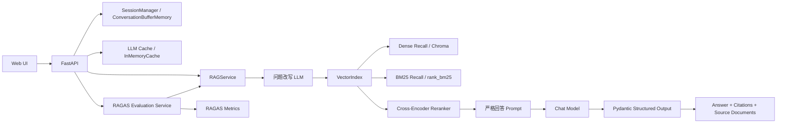

# 我用 LangChain 做了一个企业知识库 RAG 问答系统，踩了这些坑

最近我用 LangChain 做了一个偏“业务知识库”风格的 RAG 系统，不是泛搜索，也不是演示版聊天机器人，而是更贴近企业内部常见的客服 SOP、退款审批规则、OpenAPI 对接手册这类文档问答。

项目最后做成了这样一套能力：

- 支持文档上传、按路径导入
- 支持多轮对话和代词指代
- 回答严格基于上下文，不知道就明确说不知道
- 返回引用溯源，能看到答案来自哪个文档哪一段
- 检索层支持 Dense Recall + BM25 + Cross-Encoder reranking
- 用 LangChain `InMemoryCache` 做请求级缓存
- 用 RAGAS 做回归评估

这篇文章我想重点讲三件事：

1. 这套 RAG 的架构怎么搭
2. 为什么单靠“向量检索 + 大模型回答”远远不够
3. 我在实际实现里踩过哪些坑，又是怎么解决的

## 一、系统架构

先看整体架构图：



这个架构里最核心的设计点是：

- 把“检索前问题改写”和“最终回答”拆成两个阶段
- 把“召回”和“精排”拆开
- 把“在线问答”和“离线评估”拆开

这样好处是每一层都能单独调优，而不是把问题全甩给 LLM。

## 二、为什么要先改写问题再检索

很多 RAG 教程的第一版都忽略了一个现实问题：

用户的第二句、第三句往往不是完整问题。

比如：

```text
Q1: 退款金额高于 200 元怎么办？
Q2: 那它需要谁二次确认？
```

第二句里的“它”对人是清楚的，但对向量检索并不友好。  
所以我在检索前专门加了一步“问题改写”，把追问补全成独立 Query。

关键代码在 `app/rag_chain.py`：

```python
standalone_question = self._rewrite_question(llm, chat_history, question)
source_documents = self.vector_index.search(
    session_id=session.session_id,
    query=standalone_question,
    top_k=self.settings.top_k,
)
```

这一步不是为了让回答更好看，而是为了让“查资料”这一步查得更准。

## 三、为什么我最后做成了混合召回

一开始如果只用向量召回，系统在“语义相近”的问题上表现不错，但只要问题里出现：

- 专有名词
- 金额阈值
- 规则号
- 明确关键词

效果就不稳定了。

比如“退款金额高于 200 元”这种问题，BM25 的关键词特征其实很强。  
所以我后来把召回层改成了两路：

1. Dense Retrieval：处理语义近似
2. BM25 Retrieval：处理关键词和精确条件

关键代码在 `app/vector_store.py`：

```python
dense_results = self._dense_search(session_id, query, candidate_k)
keyword_results = self._keyword_search(session_id, query, candidate_k)
merged_results = self._merge_results(dense_results, keyword_results, candidate_k)
return self._rerank_results(query, merged_results, top_k)
```

这一步非常值，因为业务文档问答往往既需要语义理解，也需要精确匹配。

## 四、为什么还要再加 Cross-Encoder reranking

混合召回之后，我发现候选片段“能召回”，不代表“顺序就对”。

尤其在这些场景里，候选 Top-K 往往会混进一些看起来相关、但其实不是答案核心证据的段落：

- 同主题但不同角色权限
- 同样提到退款，但处理条件不同
- 同一个文档里相邻段落都含关键词

所以我又在召回之后加了一层 Cross-Encoder reranking：

```python
return self.reranker.rerank(query, candidates, top_k)
```

它和普通 embedding 检索最大的区别是：

- embedding 是“各自编码后再比较”
- cross-encoder 是“把 query 和 chunk 一起送进模型，直接判断相关性”

它更贵，但更准，所以特别适合放在第二阶段精排。

## 五、严格回答和结构化输出

业务问答系统最怕的不是“答不上来”，而是“答错了还很自信”。

所以 Prompt 我做了两个硬约束：

1. 必须严格基于上下文回答
2. 不知道就明确说“我不知道”

同时我没有让模型自由输出，而是用了 Pydantic 结构化输出：

```python
class StructuredAnswer(BaseModel):
    answer: str
    grounded: bool
    citations: List[Citation] = Field(default_factory=list)
```

这有两个好处：

- 前端展示稳定，不用猜模型输出格式
- 引用关系可以被程序校验，减少“胡乱引用”

## 六、缓存优化：我为什么接了 InMemoryCache

在调 Prompt、反复跑相同问题、反复回归 Benchmark 的时候，最浪费时间的其实是重复调用模型。

所以我加了一层 LangChain `InMemoryCache`：

```python
from langchain_core.caches import InMemoryCache
from langchain_core.globals import set_llm_cache

set_llm_cache(InMemoryCache())
```

不过这里有一个非常容易误解的点：

**`InMemoryCache` 不是 embedding-based 的 semantic cache，它是“完全相同 Prompt 命中”的 LLM Cache。**

我后来又加了一层简单观测，记录 hits / misses / writes / entries，方便直接在 Web 页面上看缓存状态。

## 七、RAGAS 评估怎么接

RAG 只靠肉眼看几轮问答，基本是调不稳的。  
所以我最后给项目加了一组内置 Benchmark，用 RAGAS 跑这 5 个指标：

- `faithfulness`
- `answer_relevancy`
- `context_recall`
- `context_precision`
- `answer_correctness`

核心思路是：

1. 先准备一组带参考答案的业务问题
2. 用当前 RAG 系统实际跑出答案和检索上下文
3. 再把 `question / answer / contexts / ground_truth` 喂给 RAGAS

关键代码在 `app/evaluation.py`：

```python
result = evaluate(
    Dataset.from_list(dataset_rows),
    metrics=[
        faithfulness,
        answer_relevancy,
        context_recall,
        context_precision,
        answer_correctness,
    ],
    llm=LangchainLLMWrapper(self.rag_service._build_llm()),
    embeddings=LangchainEmbeddingsWrapper(EmbeddingAdapter(self.embedding_service)),
    raise_exceptions=False,
)
```

页面里我把 RAGAS 总分和逐题分数都展示了出来，这样一调参数，马上就能看是“召回退化了”还是“生成跑偏了”。

## 八、我踩过的几个坑

### 坑 1：RAGAS 装上了，但 Python 3.8 导入直接炸

我一开始装的是 `ragas 0.2.x`，结果虽然能安装成功，但导入时直接 `SyntaxError`。  
原因不是代码写错，而是新版本内部用了 3.9+ 的语法，而我的本地环境还是 Python 3.8。

解决方式：

- 不硬升整个项目 Python 版本
- 把 `ragas` 锁到 `0.1.21`
- 在 README 里明确写出版本原因

这比“为了一个评估库把整套环境推倒重来”稳得多。

### 坑 2：把 InMemoryCache 当成语义缓存

很多人一看到“cache”就会默认以为是“相似问题也能命中”。  
其实 LangChain 的 `InMemoryCache` 不是这个意思，它只缓存完全相同的请求。

解决方式：

- 代码里照需求接入 `InMemoryCache`
- 页面和 README 里明确写“这是精确命中缓存，不是 semantic embedding cache”

技术上正确，比营销式命名更重要。

### 坑 3：评估时污染了聊天历史

如果直接拿当前会话去跑 Benchmark，`ConversationBufferMemory` 会越来越脏，后面的评估样本会受到前面问题影响。

解决方式：

- 评估时复用当前 session 的文档
- 但为每个测试问题创建隔离的 memory

这样评估仍然用的是同一套知识库和检索配置，但不会互相串台。

### 坑 4：只做 Dense Retrieval，金额阈值类问题经常漂

在业务规则文档里，“高于 200 元”“连续三次失败”“24 小时内”这类信息非常重要。  
只做语义检索，往往会把主题相关但条件不完全匹配的片段排到前面。

解决方式：

- 加 BM25 做关键词召回
- 再加 Cross-Encoder 做精排

这是我这套系统里提升最明显的一次改造。

## 九、如果让我再做一次，我会优先继续补什么

如果你已经把第一版 RAG 跑通了，我建议优先补下面三项：

1. 混合召回
2. Reranking
3. Benchmark + 回归评估

因为真正让 RAG 变“工程化”的，不是多写几个 Prompt，而是：

- 能不能稳定命中对的证据
- 能不能持续评估而不是凭感觉调参

## 十、最后

这套项目我已经把 Web 界面、缓存观测、RAGAS Benchmark、引用溯源都接起来了。  
如果你也在做中文业务知识库 RAG，我的建议是：

不要把问题都归结为“模型不够强”，很多时候真正缺的是：

- 检索前改写
- 混合召回
- 精排
- 评估
- 观测

把这几层补齐，RAG 的稳定性会比单纯换模型明显得多。
